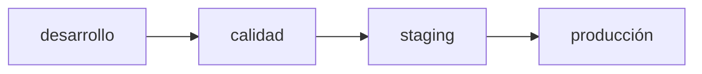

Cómo se entrega una versión nueva de **JAAK Alnitak**, cómo se aplica en cada
ambiente y cómo se vuelve atrás si hace falta.

## Versionado

Cada entrega lleva **versión semántica** (`vX.Y.Z`) derivada de los cambios
incluidos, y las imágenes se referencian por digest.

| Cambio | Qué implica |
|---|---|
| **Parche** (`v1.2.3` → `v1.2.4`) | Corrección de defectos. Sin cambios de contrato ni de datos. Actualización directa. |
| **Menor** (`v1.2.x` → `v1.3.0`) | Funcionalidad nueva compatible hacia atrás. Puede añadir campos de respuesta o parámetros opcionales. |
| **Mayor** (`v1.x.x` → `v2.0.0`) | Cambio incompatible de contrato o de datos. Exige lectura de las notas de versión y, normalmente, ventana de mantenimiento. |

Los dos componentes desplegables —**API** y **consola**— se construyen y
versionan juntos. Despliega ambos con la misma versión: una consola por delante
o por detrás de su API es una fuente de errores difíciles de leer.

## Promoción por ambientes

La ruta es **desarrollo → calidad → staging → producción**, y **nada llega a
producción sin haber pasado por los ambientes previos**. Cada promoción deja
trazabilidad de qué versión se validó dónde: la cadena de versiones es la
evidencia.

Los hotfix siguen **la misma cadena**. No se construyen imágenes fuera del
pipeline ni se re-etiqueta a mano una imagen existente.

## Antes de actualizar

| Comprobación | Cómo |
|---|---|
| Leer las notas de la versión | Especialmente si el salto es mayor |
| Confirmar que la versión ya pasó por el ambiente anterior | Trazabilidad de la promoción |
| Snapshot del clúster de Elasticsearch | Red de seguridad ante cualquier cambio que toque datos |
| Anotar la versión actual | Es el destino del rollback |
| Verificar el estado de partida | `GET /readyz`, `GET /api/v1/gallery/stats`, `GET /api/v1/metrics/summary` |

<Callout type="warning" title="Comprueba si la versión trae migración de datos">
Las notas de versión indican si hay migración de índice. Si la hay, **no es una
actualización rutinaria**: planifica ventana y lee
[Mantenimiento](/docs/alnitak/mantenimiento). Un cambio de modelo de
vectorización nunca es una actualización rutinaria.
</Callout>

## Procedimiento de actualización

Para una versión sin migración de datos:

1. **Actualiza la API.** Es un servicio sin estado con varias réplicas: la
   actualización es progresiva, réplica a réplica. Las sondas `/healthz` y
   `/readyz` gobiernan la sustitución; una réplica nueva no recibe tráfico
   hasta responder `readyz` correctamente.
2. **Espera a que todas las réplicas estén listas** antes de continuar.
3. **Actualiza la consola.**
4. **Calienta el servicio** con un puñado de consultas antes de abrir el
   tráfico completo. La primera consulta tras un arranque encuentra la caché
   vacía y no representa la latencia de régimen.
5. **Verifica** (siguiente sección).

<Callout type="tip" title="Actualización sin corte">
Con al menos dos réplicas de API y sustitución progresiva, la actualización no
requiere ventana de indisponibilidad. Con una sola réplica sí hay corte: es el
motivo por el que el dimensionado base pide 2+.
</Callout>

## Verificación posterior

Ejecuta el guion de humo entregado y, como mínimo:

| Comprobación | Esperado |
|---|---|
| `GET /healthz` y `GET /readyz` en todas las réplicas | `200` |
| Versión desplegada | La esperada, en API y consola |
| `GET /api/v1/gallery/stats` | Mismo recuento de vectores y mismo `model_version` que antes |
| Consulta 1:N de prueba | `200`, con `took_ms` y `slack_ms` coherentes |
| Petición sin credencial | `401` — confirma que la autenticación sigue activa |
| `GET /metrics` | Series presentes, sin picos de error |
| Consola | Carga, autentica por SSO y muestra datos en vivo |

Vigila durante los primeros minutos la latencia p95 y la tasa de errores 5xx.

## Rollback

Si la verificación falla:

1. **Vuelve a desplegar la versión anterior** de API y consola. Es la acción
   por defecto, y es segura mientras la versión no haya migrado datos.
2. **Verifica** con la misma lista de comprobación.
3. **Recoge evidencia antes de reintentar**: logs del intervalo, `query_id` de
   consultas afectadas, salida de `/metrics` y estado del clúster.

<Callout type="danger" title="Cuándo el rollback NO es suficiente">
Si la versión ejecutó una migración de datos —reindex, cambio de mapping,
re-vectorización— volver a la imagen anterior **no revierte el dato**. En ese
caso el rollback es el procedimiento documentado de esa migración concreta, y su
red de seguridad es el snapshot del clúster. Por eso el snapshot se toma
*antes*.
</Callout>

## Compatibilidad de la API

- Los cambios **menores** pueden añadir campos a las respuestas. Un cliente debe
  **ignorar los campos que no conoce**, no fallar ante ellos.
- Los parámetros nuevos de petición son opcionales, con valor por defecto
  equivalente al comportamiento anterior.
- Los cambios incompatibles llegan en versión **mayor** y se anuncian en las
  notas de versión.
- Los códigos de error del contrato son estables: programa contra `error.code`,
  no contra el texto de `message`.

## Actualizar Elasticsearch

Es una actualización del componente del cliente, no de Alnitak, pero afecta al
servicio:

- Sigue el procedimiento de actualización progresiva del propio Elasticsearch,
  nodo a nodo, respetando el quórum de maestros.
- Comprueba la compatibilidad de la versión destino en las notas de versión de
  Alnitak.
- Al terminar, verifica **latencia de búsqueda y número de segmentos**: un salto
  de versión puede reescribir segmentos y dejar el índice sin fusionar.
- Un cambio de versión mayor de Elasticsearch merece pasar antes por un ambiente
  no productivo con una copia de la galería.

## Actualizar el modelo de vectorización

**No es una actualización de software.** Cambia el espacio vectorial, obliga a
re-vectorizar toda la galería y exige recalibrar el umbral. Procedimiento
completo en [Mantenimiento](/docs/alnitak/mantenimiento).

## Ventanas y comunicación

| Tipo de cambio | Ventana | Aviso |
|---|---|---|
| Parche o menor sin migración | No requiere | Aviso informativo |
| Mayor sin migración | Recomendable fuera de hora pico | Acordado |
| Cualquier cambio con migración de índice | **Obligatoria** | Acordado, con impacto declarado (galería en solo lectura, altas pausadas) |
| Cambio de modelo | Obligatoria para la conmutación | Acordado, con plan de recalibración |
