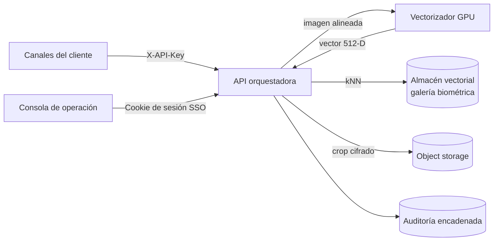

Arquitectura de extremo a extremo de **JAAK Alnitak**: qué componentes hay, qué
hace cada uno, qué ocurre en una consulta y por qué se tomaron las decisiones
tecnológicas principales.

## Componentes

| Componente | Función |
|---|---|
| **Consola de operación** | Interfaz para operadores autorizados: consulta manual 1:N, KPIs contra el SLA, alertas y trazabilidad. Acceso por SSO corporativo. |
| **API orquestadora** | Punto de entrada de todos los canales. Autentica, valida la imagen, orquesta el pipeline, aplica el veredicto, registra la auditoría y expone métricas por etapa. Sin estado, escalable horizontalmente. |
| **Servicio de vectorización facial** (GPU) | Detecta y alinea el rostro y produce el vector de 512 dimensiones. Ejecución acelerada por GPU. |
| **Almacén vectorial** | Guarda la galería como vectores de 512 dimensiones con cuantificación a 8 bits sobre grafo HNSW. Resuelve la búsqueda kNN y aplica los filtros de metadatos dentro de la misma consulta. |
| **Almacenamiento de objetos** | Custodia los recortes faciales alineados del enrolamiento, **cifrados y fuera del índice de búsqueda**. |

La custodia de los recortes cifrados es lo que permite **re-vectorizar la
galería completa ante un cambio de modelo** sin volver a pedir las imágenes
originales al cliente. El procedimiento está en el manual de mantenimiento de
la entrega.

## Pipeline de una consulta

Cinco etapas, todas medidas con reloj real en cada petición:

1. **Recepción y decodificación** — la API recibe la imagen, valida formato,
   tamaño y calidad, y la decodifica. **La imagen se procesa en memoria y no se
   persiste.**
2. **Detección y alineación** — el vectorizador detecta el rostro y lo alinea.
   Una imagen sin rostro se rechaza por calidad; una imagen con varios rostros
   se procesa con el rostro mayor y la consulta queda marcada con esa condición
   (`multi_face: true` en la respuesta).
3. **Vectorización** — el rostro alineado se convierte en un vector de 512
   dimensiones. La llamada tiene un timeout de 250 ms con un reintento.
4. **Búsqueda kNN** — el almacén vectorial recorre el grafo cuantificado y
   devuelve los `k` vecinos más cercanos.
5. **Orquestación y resolución** — la API normaliza los scores, aplica el
   umbral y el veredicto, arma la lista Top-N y registra el evento de
   auditoría.

<Callout type="tip" title="El SLA se vigila consulta a consulta">
Cada respuesta de `/identify` incluye el array `stages` con los milisegundos
reales de cada etapa, el `took_ms` total y `slack_ms` — la holgura restante
frente al presupuesto de 400 ms. No hace falta esperar a un promedio diario
para saber si una consulta concreta consumió más presupuesto del debido.
</Callout>

La etapa de búsqueda crece con el tamaño de la galería; el resto del pipeline
no depende de él. Dentro del servidor, el coste de trabajo lo dominan
**detección + vectorización (GPU)**; la búsqueda kNN se mantiene en el orden
de ~10 ms p50 a 50 M. El reloj del integrador añade además red y TLS hasta la
API (ver [Rendimiento](/docs/alnitak/rendimiento): p95 de servicio completo
con caras reales ~200 ms a 60 rps frente a un presupuesto de 400 ms).

## Score y veredicto de tres estados

El score de cada candidato es la **similitud coseno normalizada al intervalo
[0, 1]**. Con un umbral `t` configurable, la resolución es:

| Condición | Veredicto | Significado |
|---|---|---|
| `score ≥ t + 0.06` | `match` | Coincidencia. Decisión automática. |
| `t ≤ score < t + 0.06` | `review` | Revisión manual. Zona de mayor incertidumbre. |
| `score < t` | `no_match` | Sin coincidencia. |

La banda intermedia de **0.06** existe para evitar decisiones automáticas en la
franja donde el error es más probable, y dirigir esos casos a un operador. El
umbral por defecto es `0.82`, ajustable en la configuración del despliegue o
por petición.

<Callout type="tip" title="El score que recibes ya está normalizado">
Los motores de búsqueda vectorial no siempre devuelven el coseno tal cual:
según la métrica configurada pueden entregarlo reescalado. **La API se encarga
de la normalización**, de modo que el campo `score` de la respuesta y el
`threshold` que envías están siempre en la misma escala [0, 1]. No tienes que
convertir nada.
</Callout>

## Alta con control antiduplicado

En el alta de una identidad nueva el sistema **ejecuta primero una búsqueda 1:N
con el vector del enrolamiento**. Si esa búsqueda produce una coincidencia, el
alta se rechaza con `409 duplicate_or_fraud` y la respuesta incluye los
candidatos que la provocaron.

Es un control doble:

- **Antiduplicado** — higiene de la galería: un rostro, una identidad.
- **Antifraude** — un mismo rostro no puede obtener dos expedientes distintos.

## Criterios del almacén vectorial

La galería vive en un almacén vectorial que cumple cuatro condiciones, y esas
condiciones —no el producto concreto— son las que sostienen el SLA:

- **Búsqueda kNN aproximada sobre grafo HNSW**, madura y en versión estable, no
  experimental.
- **Cuantificación a 8 bits** del vector indexado, que reduce drásticamente la
  memoria de trabajo frente a los vectores en coma flotante sin cuantificar, con
  rescoring sobre los originales para no perder precisión en la ordenación
  final.
- **Filtrado por metadatos dentro de la misma consulta kNN** —canal, expediente,
  versión de modelo— y no como post-filtrado.
- **Replicación y redistribución de datos** nativas, que dan redundancia y
  capacidad de lectura sin componentes adicionales.

El cuello de botella del SLA no está en el motor vectorial: está en la GPU de
vectorización y en la disciplina de operación del índice (compactación de
segmentos, memoria residente, número de candidatos explorados).

## Resiliencia

| Mecanismo | Efecto |
|---|---|
| Timeout de 250 ms al vectorizador con un reintento | Absorbe fallos transitorios sin comprometer el presupuesto de latencia |
| Rechazo explícito por calidad | Una imagen sin rostro no genera una identificación dudosa: se rechaza y queda en auditoría |
| Marcado de consultas multirrostro | La consulta se resuelve con el rostro mayor y queda señalada para revisión |
| API sin estado tras balanceador | Cualquier réplica atiende cualquier consulta |
| Galería replicada en el almacén vectorial | La pérdida de un nodo no interrumpe las consultas ni compromete la galería |
| Vectorizador replicado | La pérdida de una réplica reduce capacidad, no disponibilidad |

## Esquema de alias de la galería

El servicio consulta **siempre por un alias**, no por el índice físico. Esa
indirección es la que permite reconstruir la galería con un modelo nuevo en un
índice paralelo y conmutar en caliente (blue/green), sin ventana de
indisponibilidad y de forma atómica: nunca hay un instante en que el alias
apunte a dos índices ni a ninguno.

El procedimiento de conmutación y los casos de migración están en el manual de
mantenimiento de la entrega.
