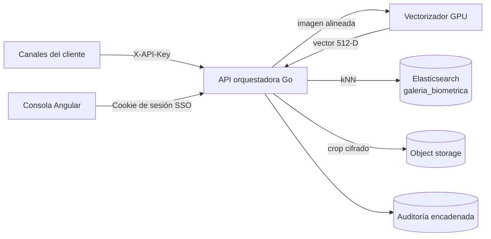

Arquitectura de extremo a extremo de **JAAK Alnitak**: qué componentes hay, qué
hace cada uno, qué ocurre en una consulta y por qué se tomaron las decisiones
tecnológicas principales.

## Componentes

| Componente | Función |
|---|---|
| **Consola de operación** (Angular) | Interfaz para operadores autorizados: consulta manual 1:N, KPIs contra el SLA, alertas y trazabilidad. Acceso por SSO corporativo. |
| **API orquestadora** (Go) | Punto de entrada de todos los canales. Autentica, valida la imagen, orquesta el pipeline, aplica el veredicto, registra la auditoría y expone métricas por etapa. Sin estado, escalable horizontalmente. |
| **Servicio de vectorización facial** (GPU) | Detecta y alinea el rostro y produce el vector de 512 dimensiones. Rust sobre ONNX Runtime, ejecución sobre GPU. |
| **Elasticsearch** (almacén vectorial) | Guarda la galería como índice `dense_vector` de 512 dimensiones con cuantificación `int8_hnsw` (`m=16`, `ef_construction=100`). Resuelve la búsqueda kNN. |
| **Almacenamiento de objetos** | Custodia los recortes faciales alineados del enrolamiento, **cifrados y fuera del índice de búsqueda**. |

La custodia de los recortes cifrados es lo que permite **re-vectorizar la
galería completa ante un cambio de modelo** sin volver a pedir las imágenes
originales al cliente (ver [Mantenimiento](/docs/alnitak/mantenimiento)).

## Pipeline de una consulta

Cinco etapas, todas medidas con reloj real en cada petición:

1. **Recepción y decodificación** — la API recibe la imagen, valida formato,
   tamaño y calidad, y la decodifica. **La imagen se procesa en memoria y no se
   persiste.**
2. **Detección y alineación** — el vectorizador detecta el rostro y lo alinea.
   Una imagen sin rostro se rechaza por calidad; una imagen con varios rostros
   se procesa con el rostro mayor y la consulta queda marcada con esa condición
   (`multi_face: true` en la respuesta).
3. **Vectorización** — el rostro alineado se convierte en un vector de 512
   dimensiones. La llamada tiene un timeout de 250 ms con un reintento.
4. **Búsqueda kNN** — Elasticsearch recorre el grafo HNSW cuantificado y
   devuelve los `k` vecinos más cercanos.
5. **Orquestación y resolución** — la API normaliza los scores, aplica el
   umbral y el veredicto, arma la lista Top-N y registra el evento de
   auditoría.

<Callout type="tip" title="El SLA se vigila consulta a consulta">
Cada respuesta de `/identify` incluye el array `stages` con los milisegundos
reales de cada etapa, el `took_ms` total y `slack_ms` — la holgura restante
frente al presupuesto de 400 ms. No hace falta esperar a un promedio diario
para saber si una consulta concreta consumió más presupuesto del debido.
</Callout>

La etapa de búsqueda crece con el tamaño de la galería; el resto del pipeline
no depende de él. El coste dominante es la **GPU**: en la medición end-to-end
de referencia la vectorización supone el 87 % del total (ver
[Rendimiento](/docs/alnitak/rendimiento)).

## Score y veredicto de tres estados

El score de cada candidato es la **similitud coseno normalizada al intervalo
[0, 1]**. Con un umbral `t` configurable, la resolución es:

| Condición | Veredicto | Significado |
|---|---|---|
| `score ≥ t + 0.06` | `match` | Coincidencia. Decisión automática. |
| `t ≤ score < t + 0.06` | `review` | Revisión manual. Zona de mayor incertidumbre. |
| `score < t` | `no_match` | Sin coincidencia. |

La banda intermedia de **0.06** existe para evitar decisiones automáticas en la
franja donde el error es más probable, y dirigir esos casos a un operador. El
umbral por defecto es `0.82` y se ajusta en
[configuración](/docs/alnitak/configuracion) o por petición.

<Callout type="danger" title="Elasticsearch no puntúa el coseno directamente">
Con `dot_product` sobre vectores L2-normalizados, Elasticsearch devuelve
`(1 + coseno) / 2`, **no** el coseno. Un umbral biométrico expresado en coseno
debe convertirse antes de aplicarlo. La API ya hace esa normalización: el campo
`score` de la respuesta está en la misma escala que el `threshold` que envías.
Si comparas contra Elasticsearch directamente, la conversión es tuya.
</Callout>

## Alta con control antiduplicado

En el alta de una identidad nueva el sistema **ejecuta primero una búsqueda 1:N
con el vector del enrolamiento**. Si esa búsqueda produce una coincidencia, el
alta se rechaza con `409 duplicate_or_fraud` y la respuesta incluye los
candidatos que la provocaron.

Es un control doble:

- **Antiduplicado** — higiene de la galería: un rostro, una identidad.
- **Antifraude** — un mismo rostro no puede obtener dos expedientes distintos.

## Por qué Elasticsearch como almacén vectorial

Se evaluaron tres opciones: Elasticsearch, Lucene embebido en la propia API y
una base de datos vectorial especializada.

**Se eligió Elasticsearch** por:

- **Es tecnología que la organización ya opera.** No se introduce una
  plataforma nueva que respaldar, securizar y aprender.
- **La búsqueda kNN con `int8_hnsw` es GA**, no experimental. La cuantificación
  int8 reduce sustancialmente la memoria de trabajo de la galería frente a los
  vectores float32 crudos.
- **Unifica galería vectorial, filtrado por metadatos y alta disponibilidad**
  en un solo sistema. Los filtros por canal o expediente se aplican dentro de
  la misma consulta kNN, y las réplicas por shard dan redundancia y capacidad
  de lectura sin componentes adicionales.

**Frente a Lucene embebido:** ataría la galería a un solo proceso, sin
réplicas, sin rebalanceo y sin un modelo de operación maduro para datos de este
tamaño.

**Frente a una base vectorial especializada:** añadiría un sistema más que
operar y respaldar, sin ventaja decisiva a esta escala trabajando con vectores
cuantificados a int8. El cuello de botella del SLA no está en el motor
vectorial, sino en la disciplina de operación del índice (segmentos, memoria,
candidatos).

## Resiliencia

| Mecanismo | Efecto |
|---|---|
| Timeout de 250 ms al vectorizador con un reintento | Absorbe fallos transitorios sin comprometer el presupuesto de latencia |
| Rechazo explícito por calidad | Una imagen sin rostro no genera una identificación dudosa: se rechaza y queda en auditoría |
| Marcado de consultas multirrostro | La consulta se resuelve con el rostro mayor y queda señalada para revisión |
| API sin estado tras balanceador | Cualquier réplica atiende cualquier consulta |
| Réplicas por shard en Elasticsearch | La pérdida de un nodo no interrumpe las consultas ni compromete la galería |
| Vectorizador replicado | La pérdida de una réplica reduce capacidad, no disponibilidad |

## Esquema de alias de la galería

El servicio consulta **siempre por el alias** `galeria_biometrica`, que apunta
al índice físico versionado `galeria_biometrica_v1`. Esa indirección es la que
permite reconstruir la galería con un modelo nuevo en un índice paralelo y
conmutar en caliente (blue/green) sin ventana de indisponibilidad.

<Callout type="warning">
Si en tu clúster ya existe un **índice plano** llamado `galeria_biometrica`
—por ejemplo, de un enrolamiento previo al esquema de alias— el servicio **no
arranca**: Elasticsearch no admite un alias con el mismo nombre que un índice
existente. Hay un procedimiento de migración única en
[Mantenimiento](/docs/alnitak/mantenimiento).
</Callout>
