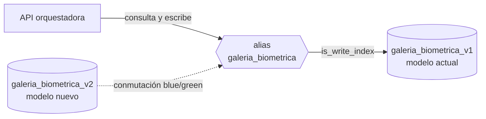

<Orientation
  audience="Arquitectura del cliente · Quien administra el clúster de Elasticsearch · Operación"
  goal="Saber cómo está guardado cada rostro, qué parámetros gobiernan la búsqueda y qué se puede tocar sin romper nada."
  before={{ title: "Arquitectura", href: "/docs/alnitak/arquitectura" }}
  outOfScope={[
    { title: "Crear el índice durante la instalación", href: "/docs/alnitak/instalacion" },
    { title: "Respaldar, migrar o re-vectorizar", href: "/docs/alnitak/mantenimiento" },
    { title: "Cifras de latencia y memoria medidas", href: "/docs/alnitak/rendimiento" },
  ]}
/>

La galería es un índice de Elasticsearch con un documento por rostro enrolado.
Esta página describe ese documento, los parámetros que gobiernan la búsqueda y
qué se puede cambiar sin romper el servicio.

## Un rostro, un documento

| Campo | Tipo | Qué guarda |
|---|---|---|
| Vector | `dense_vector`, 512 dims | El embedding facial L2-normalizado. Indexado con `int8_hnsw`. |
| Identificador biométrico | `keyword` | Identidad del rostro dentro de la galería. Es el `biometric_id` de la API. |
| Tenant | `keyword` | Organización propietaria del documento. **Obligatorio.** |
| Expediente | `keyword` | Tu identificador de negocio. Es el `record` de la API. |
| Canal | `keyword` | Origen del alta, para trazabilidad. |
| Alta | `date` | Sello de tiempo del enrolamiento. |
| Versión de modelo | `keyword` | Modelo de vectorización que produjo el vector. |

<Callout type="danger" title="Un documento sin campo de tenant es invisible">
El campo del tenant no es opcional: la API filtra **siempre** por él, derivado
de la credencial. Un documento que no lo lleve no aparece en ninguna búsqueda,
aunque su vector sea idéntico al consultado. No es un error que se vea: es un
rostro que simplemente no se encuentra nunca.
</Callout>

Los nombres reales de estos campos **son configurables** — el servicio puede
consultar un índice preexistente con otro esquema sin tocar código. Los nombres
por omisión del instalador y los del despliegue de producción no son los
mismos, así que el esquema real de tu galería sale de tu configuración: ver
[Configuración → Campos del índice](/docs/alnitak/configuracion#campos-del-índice).

## Parámetros del índice

La plantilla que crea el instalador fija lo que sostiene el rendimiento:

| Parámetro | Valor | Por qué |
|---|---|---|
| `dims` | `512` | Salida del modelo de vectorización. No es negociable: cambiarlo obliga a re-vectorizar. |
| `index_options.type` | `int8_hnsw` | Grafo HNSW sobre el vector cuantificado a 8 bits, con rescoring sobre el original. |
| `similarity` | `dot_product` | Sobre vectores L2-normalizados, el producto escalar equivale al coseno y es más barato. |
| `m` | `16` | Conexiones por nodo del grafo. |
| `ef_construction` | `200` | Esfuerzo de construcción del grafo. Se paga al indexar, no al consultar. |
| `refresh_interval` | `1s` | Un rostro recién dado de alta es buscable en un segundo. |
| `index.store.preload` | `["vec","veq","vex"]` | Fuerza la residencia en caché de los ficheros del vector y del grafo. Ver el aviso de abajo. |
| `_source.excludes` | el campo del vector | El vector no se devuelve en las respuestas: ahorra ancho de banda y no hay razón para exponerlo. |

<Callout type="warning" title="Qué precarga exactamente `index.store.preload`, y por qué revisarlo">
Los tres sufijos no son equivalentes:

| Fichero | Contenido |
|---|---|
| `veq` | Vectores **cuantificados a `int8`** — los que recorre la búsqueda |
| `vex` | El **grafo HNSW** |
| `vec` | Los vectores **originales en coma flotante**, usados solo en el rescoring final |

`veq` y `vex` son los que sostienen la latencia. `vec` es el grande: a 50 M son
~102 GB frente a los ~30 GB de los cuantificados, y precargarlo arrastra esa
memoria a la caché de páginas.

La plantilla del instalador incluye los tres. **En un despliegue donde la memoria
sea el límite, `vec` es el primer candidato a salir de esa lista** — y es la
misma advertencia que hace
[Rendimiento y capacidad](/docs/alnitak/rendimiento#memoria-y-disco-a-50-m).
Mídelo en tu despliegue antes de decidir: el rescoring se vuelve más lento sin
él, pero el grafo se recorre igual.
</Callout>

<Callout type="tip" title="La palanca de recall vive en la consulta, no en el índice">
`num_candidates` —candidatos explorados por shard antes de fusionar— se envía
en cada petición y por defecto es `800`. Es el mando entre recall y latencia, y
se puede mover consulta a consulta sin reindexar nada. `m` y `ef_construction`,
en cambio, se fijan al crear el índice.
</Callout>

### Shards y réplicas

El instalador crea la plantilla con **2 shards y 1 réplica**, dimensionado para
un arranque normal. La campaña de medición sobre 50 M corrió con **5 shards y 2
réplicas** en tres nodos de datos.

El número de shards **no se cambia en caliente**: reparticionar exige reindexar.
Decidirlo antes de cargar la galería es más barato que corregirlo después, y la
referencia de dimensionado está en
[Instalación](/docs/alnitak/instalacion) y en
[Rendimiento y capacidad](/docs/alnitak/rendimiento#memoria-y-disco-a-50-m).

<Callout type="danger" title="Cambiar de shards cambia el recall con el mismo `num_candidates`">
`num_candidates` es **por shard**. Con `800` y 5 shards se exploran 4.000
candidatos; con `800` y 2 shards, 1.600. **Mismo parámetro, recall distinto.**

Es decir: un umbral calibrado en un despliegue de 5 shards no se traslada tal
cual a uno de 2 sin revisar el recall, y las cifras de latencia medidas con 5
shards no describen a uno con 2. Al cambiar el número de shards, revisa
`num_candidates` y vuelve a
[calibrar](/docs/alnitak/precision).
</Callout>

`GET /api/v1/gallery/stats` devuelve en cualquier momento los valores efectivos
del índice: vectores, dimensiones, similitud, cuantificación, memoria,
shards, réplicas, parámetros HNSW y versión de modelo activa.

## El alias, y por qué el servicio nunca consulta el índice

El servicio consulta **siempre un alias** —`galeria_biometrica`— que apunta al
índice físico versionado —`galeria_biometrica_v1`—. El alias lleva
`is_write_index`, así que las altas también entran por él.

Esa indirección es lo que permite reconstruir la galería completa con un modelo
nuevo en un índice paralelo y preparar la conmutación sin recrear el índice en
producción. El procedimiento está en
[Mantenimiento](/docs/alnitak/mantenimiento).

<Callout type="danger" title="No crear a mano un índice con el nombre del alias">
Elasticsearch **no admite un alias con el mismo nombre que un índice
existente**. Si alguien crea `galeria_biometrica` como índice plano, la API no
puede montar el alias, `/readyz` no pasa nunca y el servicio no arranca. No es
un fallo recuperable reiniciando: hay que migrar el índice. El procedimiento y
su rollback están en
[Mantenimiento → Migrar un índice plano](/docs/alnitak/mantenimiento#migrar-un-índice-plano-preexistente).

Deja que la API cree el índice y el alias. Además de evitar la colisión, así los
nombres de campo salen de su propia configuración y no pueden desajustarse.
</Callout>

## Galerías ajenas: solo lectura

El servicio puede consultar un índice **que no administra** —de otro equipo, o
una galería histórica— sin gestionar su ciclo de vida. Dos parámetros lo
gobiernan:

| Parámetro | Efecto |
|---|---|
| `external_index: true` | El índice se consulta tal cual: no se crea alias, no se migra y ocupar el nombre no se trata como colisión. |
| `read_only: true` | El servicio solo consulta. Rechaza toda escritura —altas, re-vectorización, conmutación de alias, forcemerge, carga masiva— con el error `gallery_read_only`. |

Es el modo con el que se midieron las **consultas** contra la galería de 50 M:
el índice pertenecía a otro equipo y el servicio lo consultó sin administrarlo.
Ver [Rendimiento y capacidad](/docs/alnitak/rendimiento#lo-que-hemos-medido).

Si el índice ajeno **no tiene campo de versión de modelo**, la búsqueda no puede filtrar por modelo y se
pierde la garantía de homogeneidad: el servicio lo advierte de forma explícita
al arrancar, y conviene no ignorarlo — mezclar vectores de modelos distintos en
una misma galería produce scores que no son comparables entre sí.

## Ciclo de vida del dato

| Momento | Qué ocurre |
|---|---|
| **Alta** | Se busca 1:N con el vector nuevo. Se rechaza **solo** si el veredicto es `match`; con `review` o `no_match` se indexa el documento y se guarda el recorte facial cifrado, fuera del índice. Ver [el aviso en la referencia de API](/docs/alnitak/api#alta-en-galería). |
| **Consulta** | La imagen se procesa en memoria; el vector de consulta es transitorio. El índice no cambia. |
| **Cambio de modelo** | Se re-vectoriza a un índice paralelo desde los recortes custodiados, sin volver a pedir imágenes al cliente. |
| **Borrado** | Por segmentos completos, con acta de destrucción, y con los respaldos sujetos al mismo plazo. Ver [Seguridad → Retención y borrado](/docs/alnitak/seguridad#retención-y-borrado). |

La custodia cifrada de los recortes es la pieza que hace posible el cambio de
modelo: sin ella, actualizar el modelo obligaría a recapturar a toda la
población. Su cifrado y su clave están en
[Seguridad → Custodia de la biometría](/docs/alnitak/seguridad#custodia-de-la-biometría).
