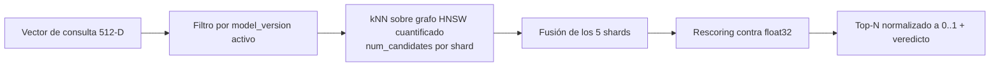
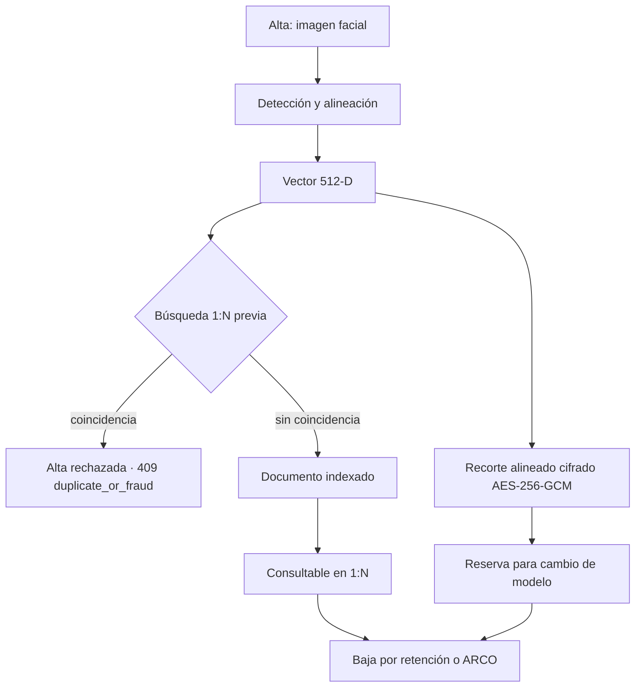

Cómo se representa, almacena y consulta la biometría en **JAAK Alnitak**: qué
es un vector, qué guarda cada documento del índice, cómo está organizado el
almacén y qué se puede y no se puede hacer con esos datos.

## Qué es un vector facial

El motor de tokenización recibe una imagen, detecta el rostro, lo alinea y
produce un **vector de 512 números en coma flotante, normalizado a norma 1**
(L2). Ese vector es la representación biométrica con la que trabaja todo el
sistema.

Tres propiedades que conviene tener claras:

| Propiedad | Implicación |
|---|---|
| **Es una representación, no una imagen.** El vector no permite reconstruir la fotografía original. | El índice de búsqueda no contiene fotografías. |
| **Solo es comparable consigo mismo.** Cada versión del modelo define su propio espacio de 512 dimensiones. | Un cambio de modelo obliga a re-vectorizar toda la galería. |
| **La comparación es geométrica.** Dos vectores se comparan por su similitud coseno. | El "parecido" es un número en [0, 1], y la decisión la pone el umbral. |

<Callout type="warning" title="Un vector biométrico es dato personal sensible">
Que no sea una imagen no lo convierte en anónimo: identifica a una persona. Se
trata con los mismos controles que la biometría original — cifrado en tránsito,
acceso por credencial con scopes, auditoría de cada consulta y política de
retención. Ver [Seguridad](/docs/alnitak/seguridad).
</Callout>

## Esquema del documento

Cada identidad enrolada es un documento del índice con estos campos:

| Campo | Tipo | Contenido |
|---|---|---|
| `id_biometrico` | `keyword` | Identificador **opaco** de la entrada biométrica. Es la clave que devuelve la API y la que aparece en la auditoría. |
| `expediente` | `keyword` | Identificador de negocio del cliente (número de expediente, contrato, cuenta…). Lo aporta el cliente en el alta. |
| `canal` | `keyword` | Canal de origen del alta, para filtrado y trazabilidad. |
| `alta` | `date` | Fecha de enrolamiento. |
| `model_version` | `keyword` | Versión del modelo que generó el vector. Toda búsqueda filtra por la versión activa. |
| `vector_rostro` | `dense_vector` (512) | El vector facial. |

### Qué NO se guarda en el índice

| Dato | Dónde vive |
|---|---|
| **La imagen de consulta** | En ningún sitio. Se procesa en memoria y no se persiste en ninguna etapa. |
| **El vector de consulta** | Transitorio: vive solo mientras se atiende la petición. |
| **El recorte facial del enrolamiento** | Cifrado con AES-256-GCM en almacenamiento de objetos, **fuera del índice de búsqueda**. |
| **Nombre, documento de identidad y demás datos personales** | Fuera del sistema. Alnitak solo conoce el `expediente` que le pasa el cliente, como cadena opaca. |

<Callout type="tip" title="El índice de búsqueda es deliberadamente pobre">
Contiene lo mínimo para resolver una búsqueda 1:N y trazarla. La correlación
entre `expediente` y la persona real vive en los sistemas del cliente, no aquí.
Eso reduce el impacto de un acceso indebido al índice y facilita el
cumplimiento en materia de minimización.
</Callout>

### Nombres de campo configurables

Los nombres de la tabla son los del esquema propio. Si la galería es
preexistente y usa otro esquema, se mapean por configuración
(`elasticsearch.fields.*`) sin tocar código. `vector` e `id` son obligatorios;
el resto puede declararse vacío si no existe en el índice destino. Ver
[Configuración](/docs/alnitak/configuracion).

## El índice vectorial

### Parámetros

| Parámetro | Valor | Qué hace |
|---|---|---|
| Dimensiones | **512** | Tamaño del vector. |
| Similitud | `cosine` | Métrica de comparación. |
| Tipo de índice | `int8_hnsw` | Grafo HNSW con **cuantificación escalar a 8 bits**. |
| `m` | `16` | Conexiones por nodo del grafo. Más `m`: mejor recall, más memoria. |
| `ef_construction` | `100` | Esfuerzo al construir el grafo. |
| `confidence_interval` | `0.99` | Calibración de la cuantificación. |
| Shards primarios | `5` | Reparto del índice. |
| Réplicas | `2` | Copias por shard: redundancia y capacidad de lectura. |

### Por qué cuantificación int8

La cuantificación reduce cada componente del vector de 4 bytes a 1. Lo que
cambia es **qué tiene que estar en memoria para servir una búsqueda**:

| Con 50 millones de vectores | Tamaño |
|---|---|
| Conjunto de trabajo caliente (vectores cuantificados + grafo) | **~30 GB por copia** |
| Vectores float32 crudos, en disco | ~102 GB por copia |
| Total en disco, shards primarios | ~126 GB |

La búsqueda recorre el grafo sobre los vectores cuantificados; **los float32
solo se leen para rescorear** unos pocos candidatos finales. Esa asimetría es
lo que hace viable el presupuesto de latencia: se dimensiona memoria para 30 GB,
no para 250 GB.

<Callout type="danger" title="No fuerces los float32 a caché de páginas">
Precargar los ficheros de vectores crudos arrastra ~102 GB por copia a memoria
sin necesidad y degrada la latencia. Es configuración corregible del índice, no
una limitación del cuantizador.
</Callout>

### El coste del int8, y cómo se compensa

Cuantificar pierde precisión numérica, y con ella algo de recall. Se compensa
con dos palancas:

- **`num_candidates`** (800 por defecto, rango operativo 500–1000): candidatos
  explorados **por shard** antes de fusionar. Más candidatos, más recall y más
  latencia.
- **Rescoring** contra los vectores float32 sobre los finalistas: la
  ordenación final no se decide con los valores cuantificados.

## Cómo se busca



Los filtros de metadatos —canal, expediente, versión de modelo— se aplican
**dentro de la misma consulta kNN**, no como un post-filtrado.

<Callout type="warning" title="La escala del score">
Con `dot_product` sobre vectores normalizados, Elasticsearch puntúa
`(1 + coseno) / 2`, **no** el coseno. La API normaliza antes de devolver: el
campo `score` y el `threshold` que envías están en la misma escala. Si consultas
el índice por tu cuenta, la conversión es tuya — y omitirla invalida cualquier
umbral biométrico.
</Callout>

Cada respuesta incluye la **consulta kNN literal** que se envió al índice
(`elasticsearch.query`), de modo que cualquier resultado es reproducible y
auditable.

## Alias y versionado del índice

El servicio consulta **siempre por un alias** (`galeria_biometrica`), que apunta
al índice físico versionado (`galeria_biometrica_v1`):

```
galeria_biometrica  ──►  galeria_biometrica_v1   (is_write_index: true)
     (alias)                  (índice físico)
```

Esa indirección es lo que permite construir una galería nueva en paralelo y
conmutar en caliente, sin ventana de indisponibilidad. El swap es **atómico**:
nunca hay un instante en que el alias apunte a los dos índices ni a ninguno.

<Callout type="danger" title="Un índice no puede llamarse igual que un alias">
Si ya existe un índice plano con el nombre del alias, el servicio no arranca.
Hay procedimiento de migración en [Mantenimiento](/docs/alnitak/mantenimiento).
</Callout>

## Ciclo de vida de una entrada



1. **Alta.** Toda alta ejecuta primero una búsqueda 1:N con su propio vector. Si
   hay coincidencia, se rechaza: la galería no admite el mismo rostro bajo dos
   identidades.
2. **Vida útil.** El documento es consultable. Su vector no cambia mientras no
   cambie el modelo.
3. **Cambio de modelo.** El vector se regenera desde el recorte cifrado, en un
   índice nuevo, sin volver a pedir la imagen original a la persona.
4. **Baja.** Borrado por segmentos completos con acta de destrucción,
   respetando la política de retención acordada. Los respaldos cumplen el mismo
   plazo.

## Capacidad y crecimiento

| Magnitud | Referencia medida |
|---|---|
| Vectores en la galería de referencia | 50.000.000, 0 rechazados |
| Disco (primarios, int8) | ~126 GB |
| Memoria caliente por copia | ~30 GB |
| Pico de disco durante un cambio de modelo | ~250 GB (conviven dos índices) |

**Cómo crece cada cosa:**

- **Más identidades** → más nodos de datos. La latencia de búsqueda crece con el
  tamaño de la galería, pero muy despacio: es la única etapa del pipeline que
  depende de él.
- **Más tráfico** → más réplicas de vectorización. El 87 % del coste de una
  consulta es la GPU, y la búsqueda no se degradó al sextuplicar la carga.

Detalle en [Rendimiento y SLA](/docs/alnitak/rendimiento).

## Higiene del índice

Tres reglas que sostienen la latencia en producción:

1. **Forcemerge tras cada carga masiva.** Una kNN recorre el grafo de cada
   segmento; un índice sin fusionar multiplica los recorridos.
2. **Un solo índice caliente por clúster.** Dos índices compitiendo por caché
   degradan la latencia de forma severa.
3. **`num_candidates` se calibra una vez** en la validación del despliegue, y se
   deja fijo.

## Consultar el estado de la galería

```bash
curl -H "X-API-Key: $KEY" "$API/api/v1/gallery/stats"
```

Devuelve recuento de vectores, dimensiones, similitud, tipo de cuantificación,
memoria del índice, shards, réplicas, parámetros HNSW y la versión de modelo
activa. Requiere el scope `read:metrics`, y es la vía recomendada: **no exige
acceso directo a Elasticsearch**.
