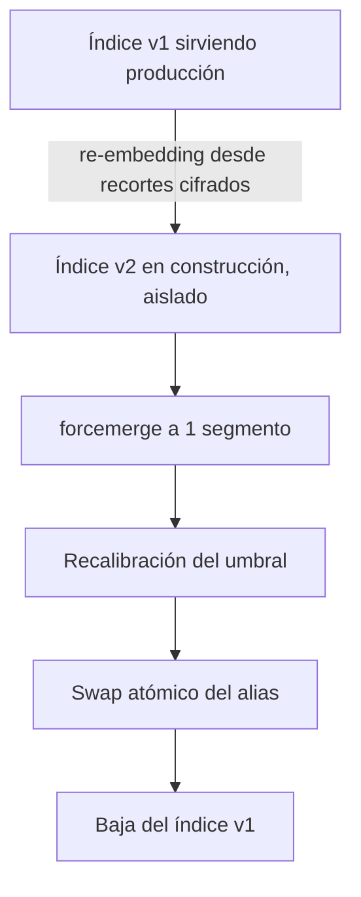

Procedimientos de mantenimiento de la galería de **JAAK Alnitak**. Todos son
operaciones privilegiadas: exigen el scope `admin:gallery` y quedan registradas
en la auditoría encadenada con actor y sello de tiempo.

## Cambio de modelo de vectorización

### Por qué obliga a re-vectorizar toda la galería

Cada entrenamiento del modelo define **su propio espacio de 512 dimensiones**.
Un vector producido por una versión no es comparable con uno producido por otra,
aunque ambos tengan la misma dimensión. No existe migración incremental ni
conversión entre espacios: **un cambio de modelo obliga a re-vectorizar la
galería completa**.

### El cinturón de seguridad: `model_version`

Cada documento guarda el campo `model_version` con la versión del modelo que
generó su vector, y toda búsqueda kNN filtra por la versión activa. Esto
**garantiza que nunca se mezclen espacios vectoriales en una consulta**. Es una
red de seguridad, no la estrategia de migración.

### Migración blue/green



1. **Re-embedding masivo.** Se construye un índice físico nuevo,
   re-vectorizando toda la galería **desde los recortes faciales alineados que
   se custodian cifrados** en el almacén de objetos. Gracias a esa custodia, la
   migración no exige volver a solicitar las imágenes originales al cliente.
2. **Aislamiento de producción.** Durante toda la construcción no se escribe en
   el índice que sirve producción: las consultas siguen atendiéndose con el
   modelo anterior, sin degradación.
3. **Forcemerge.** El índice nuevo se fusiona a un segmento antes del swap.
4. **Recalibración del umbral.** Obligatoria (ver más abajo).
5. **Swap atómico del alias.** Remove + add en una sola llamada. No existe
   ventana en la que el alias apunte a ambos índices ni a ninguno.
6. **Baja del índice anterior**, una vez estabilizado el nuevo.

### Cómo se ejecuta

```bash
# 1. Arrancar el re-embedding
curl -X POST "$API/api/v1/gallery/reembed" \
  -H "X-API-Key: $ADMIN_KEY" -H "Content-Type: application/json" \
  -d '{"target_index":"galeria_biometrica_v2","model_version":"<modelo-nuevo>"}'

# 2. Seguir el progreso
curl -H "X-API-Key: $ADMIN_KEY" "$API/api/v1/gallery/reembed/<id>"

# 3. Conmutar el alias cuando termine y esté validado
curl -X POST "$API/api/v1/gallery/alias" \
  -H "X-API-Key: $ADMIN_KEY" -H "Content-Type: application/json" \
  -d '{"new_index":"galeria_biometrica_v2"}'
```

El trabajo de re-embedding recorre la galería con `search_after` (paginación
estable para volúmenes grandes), hace streaming de los recortes desde el
almacén, los descifra en memoria, los re-vectoriza y los indexa por cargas
masivas. Es **idempotente y reanudable**: una interrupción no obliga a empezar
de cero ni deja duplicados. Reporta `processed`, `failed` y `vectors_per_sec`.

### Tiempos estimados

Sobre la capacidad medida de una GPU A10 (291 vectorizaciones por segundo):

| Tamaño de galería | Re-vectorización |
|---|---|
| 1 millón | ≈ 2,5–3,5 horas |
| 10 millones | ≈ 1–1,5 días |
| 50 millones | ≈ 5–7 días |

A esos tiempos se suma la indexación masiva y el forcemerge. **La duración no
afecta la disponibilidad**: es un proceso en segundo plano que no toca el
índice en producción.

<Callout type="danger" title="Un solo índice caliente por clúster">
Durante la migración el **disco** de primarios se duplica (de ~126 GB a ~250 GB
en una galería de 50 M int8). La **memoria** no debe duplicarse: solo el índice
activo se sirve caliente. Con ambos índices compitiendo por caché de páginas se
observó una degradación del p50 de 7 a 184 ms. El índice nuevo se construye
aislado y se conmuta al terminar.
</Callout>

### Recalibración obligatoria del umbral

Un cambio de modelo **modifica la distribución de scores**: el umbral calibrado
para el modelo anterior no es válido para el nuevo. Toda migración incluye
obligatoriamente una recalibración con el arnés de precisión y el conjunto
etiquetado, **antes del swap de alias**. El umbral nuevo entra en vigor junto
con el índice nuevo, como parte de la misma operación.

---

## Migración de índice plano a esquema de alias

Aplica **una sola vez por ambiente**, y solo si ya se enroló sobre un índice
plano llamado `galeria_biometrica` antes de adoptar el esquema de alias.

### Detectar el caso

```bash
curl -I "$ES/galeria_biometrica"          # 200 → existe algo con ese nombre
curl -I "$ES/_alias/galeria_biometrica"   # 404 → y no es un alias
```

Si se cumplen ambas, aplica este procedimiento. **Sin él, el servicio no
arranca**: Elasticsearch no admite un alias con el mismo nombre que un índice
existente.

### Impacto

La galería queda en **solo lectura** durante el reindex: las identificaciones
siguen operando contra el índice plano; **las altas se pausan**. Tiempo
estimado: de minutos en galerías pequeñas (≤ 1 M) a **1–4 horas** en galerías
de decenas de millones, según nodos de datos e IO. Planifica ventana de
mantenimiento.

### Procedimiento

**1. Congelar altas.**

```bash
curl -X PUT "$ES/galeria_biometrica/_settings" -H 'Content-Type: application/json' \
  -d '{"index.blocks.write": true}'
```

**2. Crear el índice versionado** `galeria_biometrica_v1` con el mapping
entregado, **más el campo `model_version` (`keyword`)**.

**3. Reindexar rellenando `model_version`.** Los documentos del índice plano no
lo tienen; se rellena con el modelo del vectorizador que los generó.

```bash
curl -X POST "$ES/_reindex?slices=auto&wait_for_completion=false" \
  -H 'Content-Type: application/json' -d '{
  "source": { "index": "galeria_biometrica" },
  "dest":   { "index": "galeria_biometrica_v1" },
  "script": {
    "source": "ctx._source.model_version = params.m",
    "params": { "m": "<modelo-activo>" },
    "lang": "painless"
  }
}'
```

Vigila el progreso con `GET /_tasks/<task_id>`.

**4. Verificar el recuento** antes de tocar nada más:

```bash
curl "$ES/galeria_biometrica/_count"
curl "$ES/galeria_biometrica_v1/_count"
curl "$ES/galeria_biometrica_v1/_count?q=model_version:<modelo-activo>"
```

Los tres deben coincidir. **Sin `model_version`, el filtro de las búsquedas kNN
no encontraría nada.**

**5. Forcemerge del índice nuevo.**

```bash
curl -X POST "$ES/galeria_biometrica_v1/_forcemerge?max_num_segments=1"
```

**6. Borrar el índice plano** (con el recuento verificado y snapshot del clúster
como red de seguridad):

```bash
curl -X DELETE "$ES/galeria_biometrica"
```

**7. Crear el alias**, ahora que el nombre está libre:

```bash
curl -X POST "$ES/_aliases" -H 'Content-Type: application/json' -d '{
  "actions": [
    { "add": { "index": "galeria_biometrica_v1",
               "alias": "galeria_biometrica",
               "is_write_index": true } }
  ]
}'
```

**8. Verificar el servicio.** Reinicia la API si estaba caída: ya encuentra el
alias y arranca. Comprueba que `GET /api/v1/gallery/stats` reporta el recuento
y el `model_version` esperados, ejecuta un alta de prueba (escribe en `_v1`
gracias a `is_write_index`) y corre el guion de humo.

<Callout type="warning" title="Punto de no retorno">
Hasta el paso 6 no hay vuelta atrás destructiva: basta quitar
`index.blocks.write` del índice plano y borrar `galeria_biometrica_v1`. A
partir del borrado, la única red de seguridad es el snapshot del clúster.
**Toma el snapshot antes del paso 6.**
</Callout>

---

## Carga masiva y forcemerge

Después de **cualquier** carga masiva (migración inicial, semillero,
re-embedding):

1. Desactiva réplicas y refresco **durante** la carga.
2. Restáuralos al terminar.
3. Ejecuta `_forcemerge?max_num_segments=1`.

Una kNN recorre el grafo HNSW de cada segmento y luego fusiona. Un índice con
decenas de segmentos multiplica los recorridos y la latencia — es la causa más
frecuente de un despliegue que cumple en pruebas y no en producción.

## Respaldos

| Qué | Cómo |
|---|---|
| Galería vectorial | Snapshot del clúster de Elasticsearch a repositorio cifrado. Obligatorio antes de cualquier operación destructiva. |
| Recortes faciales cifrados | Respaldo del bucket, cifrado en reposo. Es lo que hace posible re-vectorizar sin recapturar. |
| Clave AES de recortes | Versionada en el gestor de secretos, **nunca junto al objeto cifrado**. La rotación debe ensayarse. |
| Auditoría | JSONL append-only con copia remota WORM. |

<Callout type="danger" title="Perder la clave de recortes es perder la galería">
Los recortes son inútiles sin su clave. Sin recortes recuperables, un cambio de
modelo obligaría a **volver a capturar a toda la población enrolada**. La
rotación de clave y la restauración deben ensayarse, no suponerse.
</Callout>

## Modo solo lectura

Si la galería pertenece a otro equipo o se quiere blindar durante una
intervención, `elasticsearch.read_only: true` deja el servicio consultando
únicamente: rechaza altas, re-embedding, swap de alias, forcemerge y carga
masiva con un error de dominio. No crea índices ni alias, y no migra nada.
