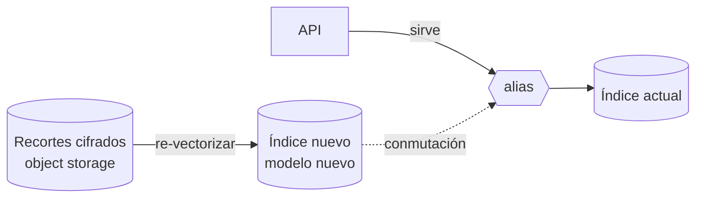

<Orientation
  audience="Quien administra el servicio y su galería: SRE del cliente"
  goal="Poder respaldar, restaurar, cambiar de modelo y migrar el índice sin perder datos ni servicio."
  before={{ title: "Galería, vectores e índice", href: "/docs/alnitak/galeria" }}
  outOfScope={[
    { title: "Actualizar la versión del software", href: "/docs/alnitak/actualizaciones" },
    { title: "Vigilancia diaria y alertas", href: "/docs/alnitak/operacion" },
    { title: "Parámetros del índice y del servicio", href: "/docs/alnitak/configuracion" },
  ]}
/>

Las cuatro operaciones de mantenimiento de la galería, con sus tiempos, su
impacto en el servicio y su rollback.

| Operación | Impacto en el servicio | Cuándo |
|---|---|---|
| [Respaldos](#respaldos-de-la-galería) | Ninguno | Automático, diario |
| [Restauración](#restauración) | Galería no disponible | Ante pérdida de datos |
| [Re-vectorización](#re-vectorización-con-un-modelo-nuevo) | Ninguno hasta la conmutación | Cambio de modelo |
| [Migración de índice plano](#migrar-un-índice-plano-preexistente) | Galería en solo lectura | Una vez, si aplica |

---

## Respaldos de la galería

El instalador registra un repositorio de instantáneas en un contenedor
compatible con S3, comprueba que es **accesible y escribible**, programa la copia
periódica y **toma una primera instantánea de comprobación**. Si el repositorio
no es escribible, la instalación falla diciendo por qué: no se deja programada
una copia que nunca va a funcionar.

### Configuración

| Parámetro | Por omisión | Qué es |
|---|---|---|
| `respaldos_bucket` | *(vacío)* | Contenedor de las instantáneas. **Vacío desactiva las copias.** |
| `respaldos_endpoint` | *(vacío)* | Vacío = S3 de AWS. Se rellena para MinIO u otros |
| `respaldos_ruta` | `galeria` | Prefijo dentro del contenedor |
| `respaldos_programacion` | `0 30 1 * * ?` | Cron de Elasticsearch: `segundos minutos horas día mes díaSemana`. Por omisión, diario a la 01:30 |
| `respaldos_retener_dias` | `30` | Plazo de retención |
| `respaldos_retener_min` | `5` | Nunca conservar menos, aunque caduquen |
| `respaldos_retener_max` | `50` | Ni más |

<Callout type="danger" title="El respaldo declarado a medias no da error">
Las credenciales del contenedor van en el `tfvars` de Terraform, porque
Elasticsearch solo las lee de su almacén seguro; el nombre del contenedor y la
programación van en el fichero del playbook. **Configurar solo uno de los dos no
produce ningún error**: simplemente no habría respaldos, y nadie se enteraría
hasta necesitar restaurar. `install.sh` compara ambos antes de empezar.
</Callout>

<Callout type="info" title="En AWS con rol de IAM">
Las claves de acceso pueden ir vacías si el rol de IAM de los nodos ya permite
escribir en el contenedor.
</Callout>

### Verificar que los respaldos siguen ocurriendo

Es la comprobación de mantenimiento más rentable, porque su fallo es silencioso.
Confirma periódicamente que **la última instantánea existe y terminó bien**, no
solo que la programación está registrada. Una instantánea programada que lleva
días fallando se ve exactamente igual que una que funciona, si nadie la mira.

Añádelo a la rutina de turno: ver
[Operación → Rutina de turno](/docs/alnitak/operacion#rutina-de-turno).

### Retención y borrado

El plazo de retención de las instantáneas **no es independiente** del plazo del
dato en línea: un dato eliminado no puede sobrevivir en los respaldos más allá
del plazo acordado. Ver
[Seguridad → Retención y borrado](/docs/alnitak/seguridad#retención-y-borrado).

---

## Restauración

La restauración de una instantánea **sustituye la galería**. Antes de empezar:

1. **Detén las altas.** Restaurar sobre una galería que sigue recibiendo
   enrolamientos pierde los que entren durante la operación.
2. **Elige la instantánea** y confirma su fecha y su recuento de documentos.
3. **Restaura a un índice nuevo**, no sobre el que está sirviendo. El esquema de
   alias existe precisamente para esto: se restaura en paralelo y se conmuta.
4. **Verifica el recuento** antes de conmutar.
5. **Conmuta el alias** al índice restaurado.
6. **Reanuda las altas** y comprueba `/readyz` y una consulta real.

<Callout type="warning" title="Los recortes cifrados y la galería son dos respaldos distintos">
Las instantáneas cubren el índice de vectores. Los **recortes faciales
cifrados** viven en el almacenamiento de objetos y tienen su propio respaldo,
responsabilidad de la infraestructura del cliente. Perder los recortes no rompe
el servicio hoy, pero **imposibilita cualquier cambio de modelo futuro**: no
habría de dónde re-vectorizar sin recapturar a toda la población.
</Callout>

---

## Re-vectorización con un modelo nuevo

Cambiar el modelo de vectorización obliga a reconstruir todos los vectores: un
vector producido por un modelo no es comparable con el de otro. El
procedimiento **no requiere volver a pedir imágenes al cliente**, porque los
recortes faciales alineados están custodiados cifrados.



### Procedimiento

Los tres endpoints requieren el scope `admin:gallery` y **separación de
funciones**: reescriben o sustituyen la galería completa.

| Paso | Endpoint |
|---|---|
| 1. Arrancar la re-vectorización a un índice paralelo | `POST /api/v1/gallery/reembed` |
| 2. Seguir el progreso | `GET /api/v1/gallery/reembed/{id}` |
| 3. Conmutar el alias al índice nuevo | `POST /api/v1/gallery/alias` |

Las tres operaciones quedan **auditadas**, con actor e índices de origen y
destino.

### Antes de conmutar

<Callout type="danger" title="Un umbral calibrado para un modelo no sirve para otro">
Los scores de dos modelos distintos no son comparables: cada entrenamiento
define su propio espacio de 512 dimensiones y su propia distribución de scores.
Conmutar el alias sin recalibrar cambia, de golpe y sin avisar, el
comportamiento de todas las decisiones automáticas del sistema.

Y no falla en una dirección predecible: el umbral viejo puede quedar **demasiado
laxo** (falsos positivos en masa) o **demasiado estricto** (genuinos rechazados
en masa). No se puede estimar a ojo ni ajustar por proporción.

**Recalibra antes de conmutar, no después.** El procedimiento está en
[Precisión y calibración del umbral](/docs/alnitak/precision#cada-cambio-de-modelo-obliga-a-recalibrar).
</Callout>

Lista de comprobación antes de la conmutación:

1. El recuento de documentos del índice nuevo iguala al del actual.
2. Todos los documentos llevan la versión de modelo nueva.
3. El índice nuevo está compactado y caliente.
4. El umbral está [recalibrado](/docs/alnitak/precision) sobre el índice nuevo,
   y el JSON de la corrida archivado.
5. Hay una instantánea del índice actual.

**Rollback**: conmutar el alias de vuelta al índice anterior, que sigue intacto.
Por eso no se borra el índice viejo hasta haber servido con el nuevo el tiempo
que decida el cliente.

### Compactación

Tras cualquier reconstrucción masiva, compacta los segmentos del índice nuevo
**antes** de ponerlo a servir producción: el grafo HNSW queda en estado óptimo y
la latencia de búsqueda vuelve a su régimen. Un índice recién escrito y sin
compactar tiene una latencia de búsqueda que no representa lo que va a rendir.

---

## Migrar un índice plano preexistente

Aplica **una sola vez por ambiente**, y solo en despliegues donde ya se enroló
sobre un índice plano antes del esquema de alias.

### Detectar el caso

Si `HEAD /galeria_biometrica` responde `200` pero `HEAD /_alias/galeria_biometrica`
responde `404`, existe un índice plano ocupando el nombre del alias y este
procedimiento aplica.

<Callout type="danger" title="El síntoma es que el servicio no arranca">
Elasticsearch **no admite un alias con el mismo nombre que un índice
existente**. La API no puede crear el alias, `/readyz` no pasa nunca y el
servicio no levanta. No es un fallo del que se salga reiniciando.
</Callout>

### Impacto y ventana

**La galería queda en solo lectura durante el reindex**: las consultas de
identificación siguen funcionando contra el índice plano; **las altas se
pausan**.

| Tamaño de galería | Tiempo estimado |
|---|---|
| ≤ 1 M de vectores | Minutos |
| Decenas de millones | **1–4 horas** |

El reindex reconstruye el grafo HNSW en el índice destino, así que el tiempo
depende del número de nodos de datos y del IO disponible. **Planifica ventana de
mantenimiento.**

### Procedimiento

El playbook lo automatiza:

```bash
ansible-playbook site.yml --tags migracion
```

Los pasos que ejecuta, para que sepas qué está pasando y dónde estás si se
interrumpe:

1. **Congelar altas.** Se bloquean las escrituras sobre el índice plano; las
   consultas kNN siguen atendiéndose con normalidad.

   ```
   PUT /galeria_biometrica/_settings
   { "index.blocks.write": true }
   ```

2. **Crear el índice versionado** `galeria_biometrica_v1` con el mapping de la
   galería **más el campo de versión de modelo**, que es obligatorio.

3. **Reindexar rellenando la versión de modelo.** Los documentos del índice
   plano no la tienen; se rellena con el modelo del vectorizador que los generó.

   ```
   POST /_reindex?slices=auto&wait_for_completion=false
   {
     "source": { "index": "galeria_biometrica" },
     "dest":   { "index": "galeria_biometrica_v1" },
     "script": {
       "source": "ctx._source.model_version = '<modelo-de-origen>'",
       "lang": "painless"
     }
   }
   ```

   El progreso se sigue con `GET /_tasks/<task_id>`.

4. **Verificar el recuento.** Antes de tocar nada más, que no se perdió ni
   duplicó ningún documento:

   ```
   GET /galeria_biometrica/_count
   GET /galeria_biometrica_v1/_count
   ```

   Deben ser iguales. Y el recuento filtrado por versión de modelo debe dar el
   mismo total: **sin ese campo, el filtro de las búsquedas no encontraría
   nada.**

5. **Compactar el índice nuevo**, para que el grafo HNSW quede óptimo antes de
   servir producción.

   ```
   POST /galeria_biometrica_v1/_forcemerge
   ```

6. **Borrar el índice plano**, con el recuento verificado y una instantánea del
   clúster como red de seguridad. Es lo que libera el nombre.

   ```
   DELETE /galeria_biometrica
   ```

7. **Crear el alias** con `is_write_index`, ahora que el nombre está libre:

   ```
   POST /_aliases
   {
     "actions": [
       { "add": { "index": "galeria_biometrica_v1",
                  "alias": "galeria_biometrica",
                  "is_write_index": true } }
     ]
   }
   ```

8. **Verificar el servicio.** Reiniciar la API si estaba caída: ya encuentra el
   alias y arranca. Confirmar que `GET /api/v1/gallery/stats` reporta el
   recuento esperado y su versión de modelo, y correr un alta de prueba — el
   alta por alias escribe en el índice versionado gracias a `is_write_index`.

<Callout type="warning" title="Dónde está el punto de no retorno">
**Hasta el paso 6 no hay vuelta atrás destructiva**: basta quitar el bloqueo de
escritura del índice plano y borrar el índice nuevo. Después del paso 6, la red
de seguridad es la instantánea del clúster. No ejecutes el paso 6 sin haber
verificado el recuento del paso 4.
</Callout>

---

## Rotación de claves

| Clave | Efecto de rotarla | Obliga a re-vectorizar |
|---|---|---|
| **Clave maestra de cifrado de recortes** | Los recortes se re-cifran con la versión nueva | **No.** Son planos independientes |
| **Pimienta de API keys** | **Todas las credenciales de servicio dejan de verificar**: hay que reemitirlas | No |
| **Pimienta de contraseñas** | Las contraseñas existentes dejan de verificar | No |
| **Clave privada RS256** | Las sesiones abiertas de la consola caducan | No |
| **API key de la API contra Elasticsearch** | Ninguno si se rota con el playbook: reinicia la API | No |

La clave maestra vive en el gestor de secretos, versionada, con identidad de
workload, permisos mínimos y auditoría de acceso — **nunca junto al objeto
cifrado**. La rotación debe estar ensayada antes de necesitarla.

Para rotar la credencial de Elasticsearch:

```bash
ansible-playbook site.yml -e forzar_credencial_es=true
```

<Callout type="danger" title="Las dos pimientas deben ser distintas">
Si comparten valor, rotar las API keys expulsa a las personas de la consola. Es
la razón por la que se separan desde la instalación. Ver
[Instalación → 6.1](/docs/alnitak/instalacion#61-secretos-genéralos-fuera-para-producción).
</Callout>
