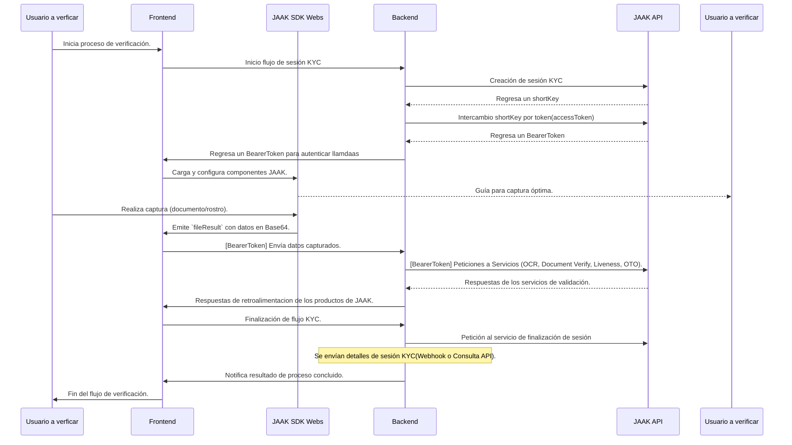

En este apartado explicaremos cómo hacer una integración de **JAAK KYC para API**. Antes de comenzar es necesario haber consultado la sección [**JAAK KYC**](/docs/verificar-identidad) ya que será necesario contar con un **Short Key**.

> Este diagrama ilustra un flujo de verificación de identidad (KYC) integrado mediante API. A través de un intercambio de claves, se obtiene un `BearerToken` que autoriza y agrupa las llamadas por sesión KYC (shortKey). En el frontend, los componentes del JAAK SDK se encargan de guiar al usuario para una captura óptima de sus documentos y datos biométricos, emitiendo los resultados en formato Base64. Finalmente, el backend recibe esta información y orquesta las llamadas a los productos de JAAK (como OCR, Liveness y verificación de documentos).

## Requisitos

Todas las llamadas API que realizaremos a continuación será mediante la arquitectura [REST](https://es.wikipedia.org/wiki/Transferencia_de_Estado_Representacional) (Representational State Transfer), con el estándar web [HTTP](https://es.wikipedia.org/wiki/Protocolo_de_transferencia_de_hipertexto) (HyperText Transfer Protocol) y firmando la comunicación con el formato [JSON](https://en.wikipedia.org/wiki/JSON) (JavaScript Object Notation).

Recomendamos tener un conocimiento por lo menos básico de estos 3 conceptos para poder continuar con esta guía.
