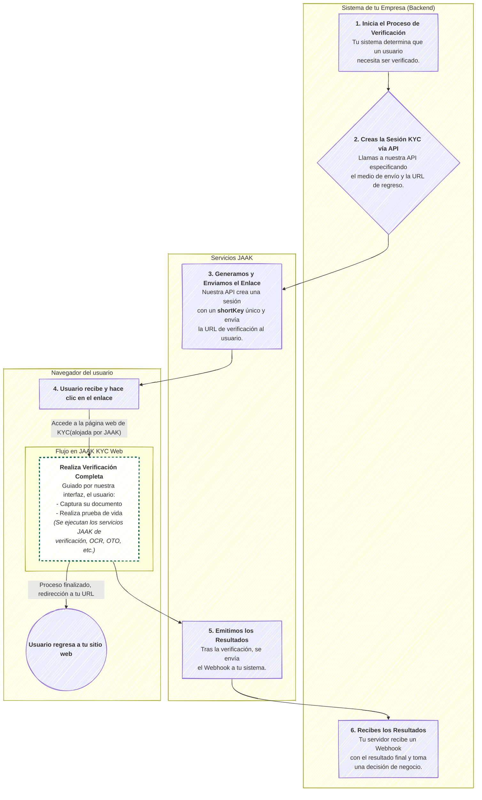

Este documento te guiará para poner en marcha el proceso de verificación de identidad de JAAK utilizando nuestra solución de marca blanca (`white-label`), también conocida como `JAAK KYC Web`. Este método es la forma más rápida de integrar un flujo de KYC completo y optimizado, ya que JAAK proporciona la interfaz gráfica para el usuario final.

El objetivo es simple: generar un enlace único de sesión y dirigir a tu usuario a JAAK KYC Web, una webapp para que complete su verificación .




> Este diagrama muestra nuestro flujo de Implementación vía Marca Blanca, una solución de bajo código ideal para una integración rápida y segura. Generamos y enviamos un enlace único al usuario, lo guiamos a través de nuestra interfaz web personalizable para que complete el proceso de KYC (captura de documentos, prueba de vida, etc.), y al finalizar, lo redirigimos de vuelta a tu sitio. De forma asíncrona, tu sistema recibe los resultados finales a través de un Webhook, permitiéndote tomar decisiones de negocio de manera automática y eficiente.

### **Paso 1: Configuración de la Marca Blanca**

Antes de iniciar, puedes personalizar la apariencia del flujo de verificación para que se alinee con la identidad visual de tu empresa.

1. **Accede a la Plataforma JAAK.**
2. Navega a la sección de **"Ajustes"** en el menú.


3. Dentro de "Ajustes", selecciona la opción **"Mi empresa"**.


4. Haz clic en el botón **"Editar"** que aparece en la esquina inferior derecha.


5. Se abrirá un formulario donde podrás:
   * Cambiar el **nombre de la empresa**.
   * Subir o actualizar la imagen de tu **logo**.
   * Definir tus **colores primarios y secundarios**.

Estos ajustes se reflejarán en la interfaz que verán tus usuarios finales.

***

### **Paso 2: Creación de la Sesión KYC**

Cada usuario que necesite verificar su identidad requiere una **Sesión KYC** única. Al crear la sesión, se genera una URL a la que deberás enviar a tu usuario. Tienes dos formas de crear esta sesión:

#### **A. Vía API (Método recomendado para automatización)**

Este método es ideal para integrar la creación de sesiones directamente en tu sistema.

1. **Obtén tu API Key:**
   * Ingresa a la Plataforma JAAK (`https://platform.jaak.ai` o `https://sandbox.jaak.ai`).
   * Ve a la sección `Ajustes -> Api keys` y genera una nueva clave. Guárdala en un lugar seguro.


2. **Realiza una llamada`POST`:** Envía una petición al siguiente endpoint para crear el flujo.

   ***

   #### **Detalles de la llamada API: Crear Sesión KYC**

   `POST` `https://api.sandbox.jaak.ai/api/v1/kyc/flow`

   Crea una nueva sesión de verificación y genera una URL de sesión que contiene un Short Key único.

   **Headers**

   | Parámetro       | Tipo   | Descripción                          |
   | --------------- | ------ | ------------------------------------ |
   | `Authorization` | string | Tu API Key con el prefijo "Bearer ". |

   **Body** (`application/json`)

   | Campo              | Tipo   | ¿Requerido? | Descripción                                                                                                    |
   | ------------------ | ------ | ----------- | -------------------------------------------------------------------------------------------------------------- |
   | `name`             | string | Sí          | El nombre de la persona que realizará la Sesión KYC.                                                           |
   | `flow`             | string | Sí          | Nombre que puedes otorgarle a la Sesión KYC.                                                                   |
   | `redirectUrl`      | string | Opcional    | URL para redirigir al usuario al finalizar la sesión.                                                          |
   | `countryDocument`  | string | Sí          | Código del país del documento a aceptar (nomenclatura Alpha 3).                                                |
   | `flowType`         | string | Sí          | El tipo de KYC a realizar, por defecto se usa "KYC".                                                           |
   | `verificationType` | string | Opcional    | Método de notificación: "whatsapp", "sms", "email" o "" (vacío para no notificar).                             |
   | `verification`     | object | Opcional    | Objeto que contiene el destino de la notificación (teléfono o email) según el `verificationType` seleccionado. |

   ***

   * **Ejemplo de Petición:**
     ```json
     {
       "name": "Nombre Completo del Usuario",
       "flow": "OnBoarding",
       "countryDocument": "MEX",
       "redirectUrl": "https://www.tu-sitio.com/verificacion-completa",
       "verificationType": "email",
       "verification": {
         "EMAIL": "usuario.final@email.com"
       }
     }
     ```

3. **Recibe la URL de la Sesión:** La respuesta de la API te devolverá una `sessionUrl`. Este es el enlace principal dónde el usuario final realizará el flujo.

   * **Ejemplo de Respuesta:**
     ```json
     {
       "sessionUrl": "https://sandbox.kyc.jaak.ai/session/WIoGa8e"
     }
     ```

   * **Nota:** El `Short Key` son los últimos 7 caracteres de la URL (en este ejemplo, `WIoGa8e`).

<Callout type="info" title="Información Importante">
El número telefónico que se envía en los parámetros "**verification.SMS**" y "**verification.WHATSAPP**" deben contener el código del país, por ejemplo:
* **+52** para México
* **+1** para Estados Unidos
</Callout>


#### **B. Desde la Plataforma JAAK (Método manual)**

1. En la plataforma, ve a `KYC -> Sesiones` y haz clic en **"Crear nueva Sesión KYC"**.


2. Completa el formulario con los datos del usuario y la **"Url de redireccionamiento"**.
3. Guarda y copia la URL de la sesión generada.

***

### **Paso 3: Dirigir al Usuario al Flujo JAAK KYC**

Tienes dos maneras de hacer llegar el enlace de la sesión al usuario:

1. **Redirección Directa:** Utiliza la `sessionUrl` obtenida en el paso anterior y colócala en un botón ("Verificar mi identidad") dentro de tu sitio web o aplicación para que el usuario inicie el flujo.
2. **Notificación Automática de JAAK:** Puedes configurar la llamada API del Paso 2 para que JAAK envíe el enlace por ti a través de **WHATSAPP, SMS o EMAIL**. Para ello, configura los campos `verificationType` (`"WHATSAPP"`, `"SMS"`, `"EMAIL"`) y `verification` con el dato correspondiente.

   * **Nota Importante:** El emisor de estas notificaciones siempre será JAAK. No es posible configurar un remitente personalizado, ya que los servicios de envío (SMTP, configuración de META, número telefónico) son propiedad de JAAK.

***

### **Paso 4: El Usuario Completa el Proceso**

Una vez en la `sessionUrl`, el usuario será guiado por la interfaz de JAAK para completar los siguientes pasos:

1. Aceptación de términos, condiciones y políticas de privacidad.
2. Otorgar permisos para la captura de su geolocalización.
3. Tomar una fotografía del anverso de su documento.
4. Tomar una fotografía del reverso del documento.
5. Grabar un corto video de su rostro (prueba de vida).

***

### **Paso 5: Notificación y Consulta de Resultados**

Al finalizar el flujo, el usuario será redirigido a la `redirectUrl` que configuraste en pasos previos para volver a un sitio web o app.

Para recibir una notificación automática de que el proceso ha terminado y consultar los resultados, tienes dos opciones:

1. **Notificación por Webhook (Recomendado):** Para que tu servidor reciba una notificación automática, configura un webhook:
   * Ve a `Ajustes -> Mi empresa` en la Plataforma JAAK.
   * Pulsa el botón **"Editar"**.
   * En el formulario, busca la subsección **"Productos"**.
   * Añade la URL de tu endpoint en el campo **"KYC Webhook"**.

2. **Notificación por Email:** Puedes configurar una notificación por correo electrónico directamente desde las opciones de la Plataforma JAAK.

Adicionalmente, siempre podrás consultar el detalle de cada verificación de forma manual en la sección `KYC -> Sesiones` de la plataforma.

***

**¡Y listo!** Con estos cinco pasos, has implementado un flujo de verificación de identidad robusto y seguro.
